# 💼 Salary Management System

Une application web complète de gestion des salaires développée en **Laravel** et intégrée avec **ERPNext/Frappe Framework**. Cette solution utilise le module RH d'ERPNext (projet open source) pour offrir une interface moderne et intuitive de gestion des employés, salaires et rapports financiers.

## 🚀 Fonctionnalités Principales

### 🔐 1. Authentification ERPNext
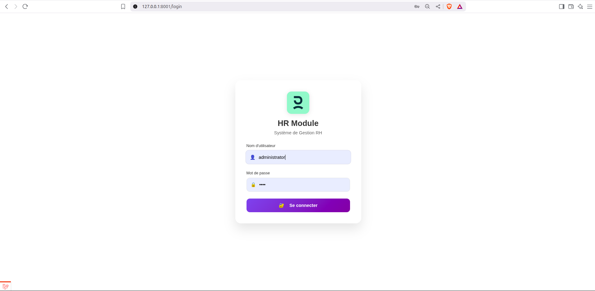
- Connexion sécurisée via compte ERPNext/Frappe
- Interface de login moderne et responsive
- Authentification basée sur l'API ERPNext

### 👥 2. Gestion des Employés
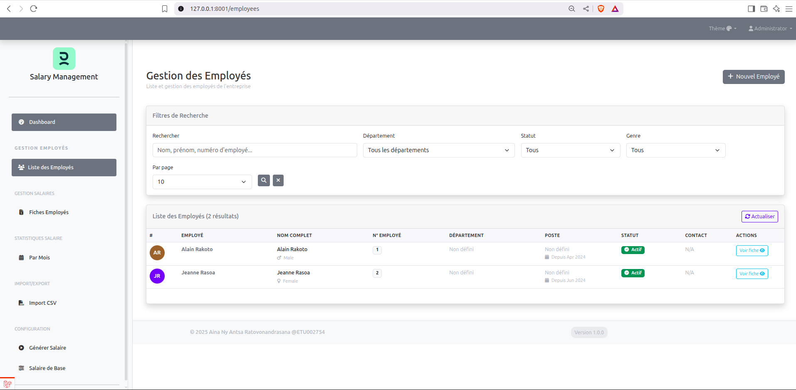
- **Liste des employés** avec système de filtrage avancé par critères multiples
- Recherche dynamique et tri personnalisable
- Synchronisation automatique avec le module RH d'ERPNext

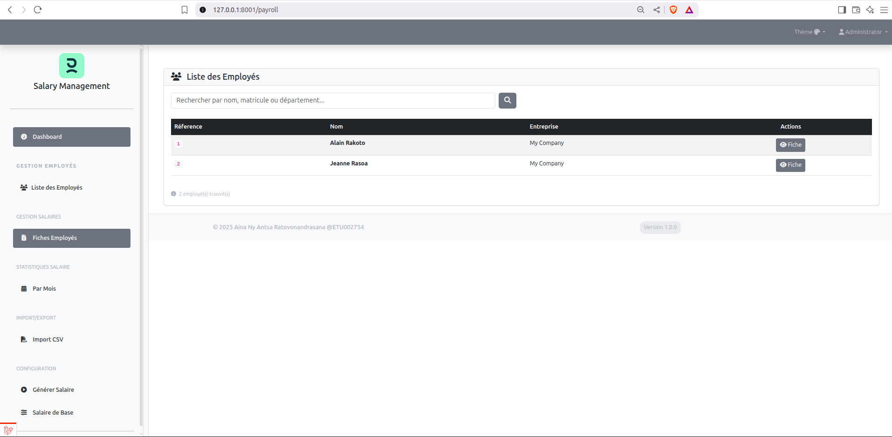 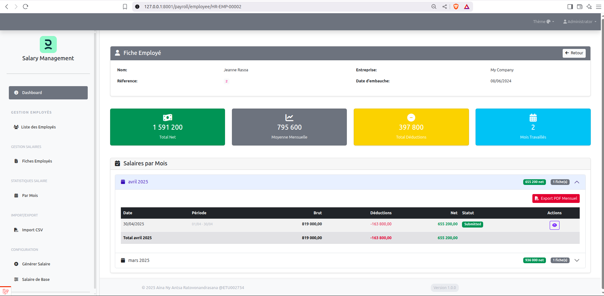
- **Fiche employé détaillée** avec historique complet des salaires mensuels
- Vue d'ensemble des informations personnelles et professionnelles
- Bouton "Voir fiche" pour accès rapide aux détails

### 📊 3. Gestion des Fiches de Paie
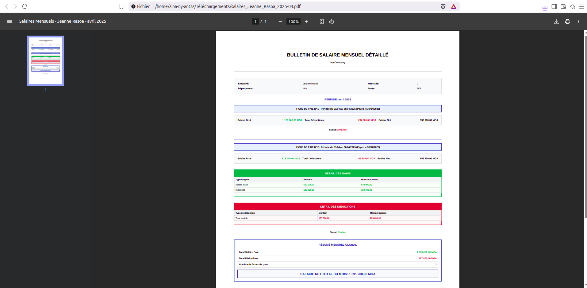
- **Export PDF** des fiches de paie avec mise en forme professionnelle
- Génération automatique des documents officiels
- Template personnalisable selon les besoins légaux

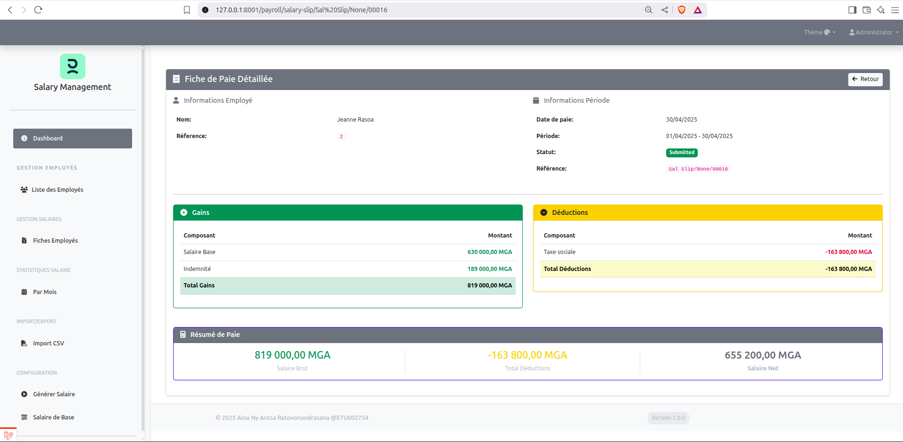
- **Fiche de paie détaillée** avec tous les éléments de calcul
- Décomposition complète : gains, déductions, cotisations
- Calculs automatiques basés sur les structures salariales ERPNext

### 📋 4. Tableau de Bord Salarial
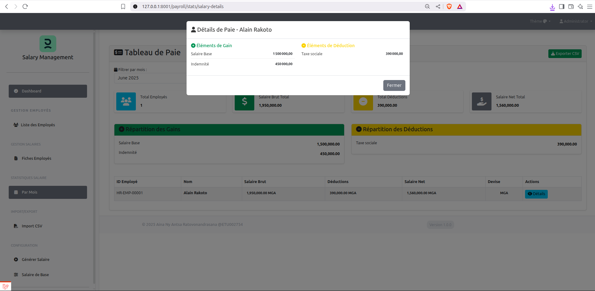
- **Tableau avec filtres par mois** contenant tous les employés
- Affichage des éléments de salaire et totaux automatiques
- Vue consolidée pour la gestion mensuelle

### 📈 5. Analyses et Statistiques
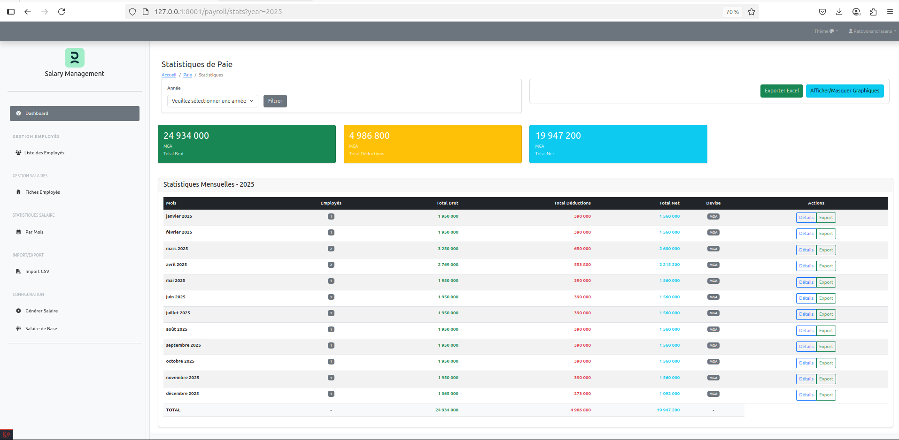
- **Statistiques annuelles** : tableaux par mois avec totaux salariaux détaillés
- Analyse par composant de salaire (base, primes, déductions)
- **Filtrage par année** pour analyses historiques approfondies

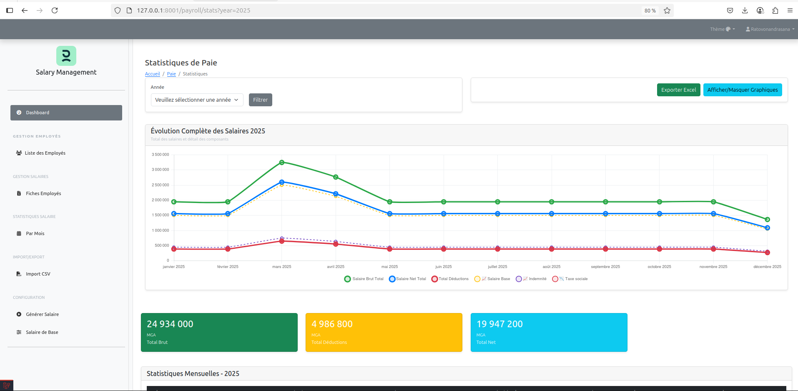
- **Graphiques d'évolution** du total des salaires dans le temps
- Visualisation des différents éléments de salaire
- Tendances et projections salariales

### ⚙️ 6. Configuration et Automatisation
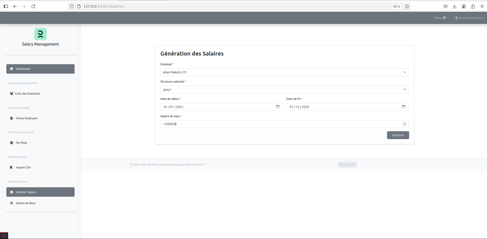 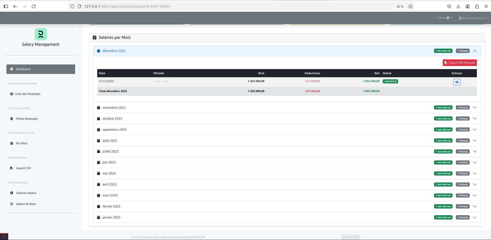
- **Génération automatique** des salaires manquants entre deux dates
- Formulaire de configuration pour générer les mois manquants
- Exemple : génération automatique de 1,500,000 Ar pour les périodes manquantes

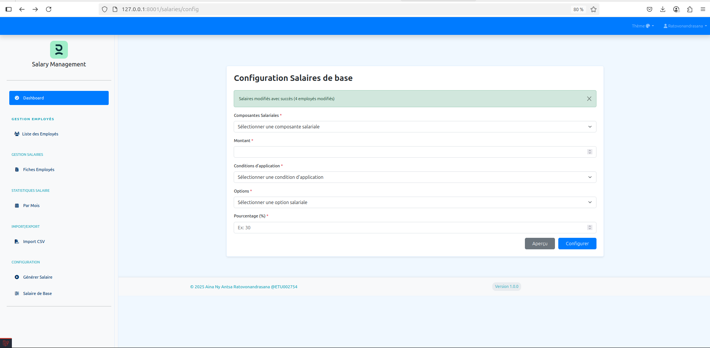
- **Modification du salaire de base** par conditions et règles personnalisées
- Gestion des augmentations et ajustements salariaux
- Interface intuitive pour les modifications en masse

### 📥 7. Import de Données CSV
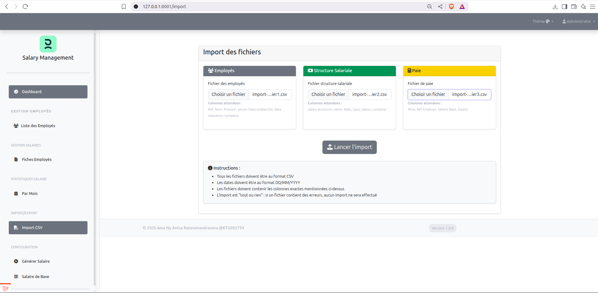
- **Import en masse** via fichiers CSV pour trois types de données
- Validation automatique des données importées
- Interface de mapping des colonnes

## 📋 Formats d'Import CSV

### Employés (`employe.csv`)
```csv
Ref,Nom,Prenom,genre,Date embauche,date naissance,company
1,Rakoto,Alain,Masculin,03/04/2024,01/01/1980,My Company
2,Rasoa,Jeanne,Feminin,08/06/2024,01/01/1990,My Company
```

### Structure Salariale (`StructureSalariale.csv`)
```csv
salary structure,name,Abbr,type,valeur,company
g1,Salaire Base,SB,earning,base,Orinasa SA
g1,Indemnité,IDM,earning,SB * 0.35,Orinasa SA
g1,Taxe spéciale,TSP,deduction,(SB + IDM) * 0.21,Orinasa SA
g1,Impot,IMP,deduction,(SB + IDM - TSP ) * 0.1,Orinasa SA
```

### Paies (`paie.csv`)
```csv
Mois,Ref Employe,Salaire Base,Salaire
01/04/2025,1,1300000,g1
01/04/2025,2,910000,g1
01/03/2025,2,850000,g1
```

## 🛠️ Architecture Technique

### Stack Technologique
- **Framework Backend** : Laravel 10.x
- **Système ERP** : ERPNext/Frappe Framework (Open Source)
- **Module Principal** : Module RH d'ERPNext
- **API Communication** : API REST ERPNext/Frappe
- **Base de données** : MySQL/MariaDB (via ERPNext)
- **Frontend** : Blade Templates + Bootstrap/Tailwind CSS
- **Authentification** : Laravel Sanctum + ERPNext Auth
- **Export PDF** : DomPDF/TCPDF
- **Graphiques** : Chart.js/ApexCharts

### Intégration ERPNext/Frappe
- **Communication API** : Utilisation de l'API REST d'ERPNext
- **Module RH** : Exploitation complète des fonctionnalités RH d'ERPNext
  - Gestion des employés (Employee)
  - Structures salariales (Salary Structure)
  - Fiches de paie (Salary Slip)
  - Composants de salaire (Salary Component)
- **Synchronisation** : Synchronisation bidirectionnelle des données
- **Authentification** : Authentification via les comptes ERPNext

### Fonctionnalités Laravel
- **Artisan Commands** : Commandes personnalisées pour l'import et la synchronisation
- **Jobs/Queues** : Traitement asynchrone des calculs de salaire
- **Middleware** : Authentification et validation des requêtes API
- **Models** : Modèles Eloquent pour la gestion locale des données
- **Services** : Services dédiés pour la communication avec ERPNext

## 📸 Aperçu des Fonctionnalités

L'application propose une interface intuitive avec :
- Dashboard de connexion sécurisé
- Liste des employés avec recherche et filtres
- Fiches employés détaillées
- Génération et export PDF des fiches de paie
- Tableaux de bord avec statistiques complètes
- Graphiques d'évolution temporelle
- Outils de configuration et d'import

## 🔧 Installation et Configuration

### Prérequis
- **PHP** 8.1 ou supérieur
- **Composer** pour la gestion des dépendances
- **Node.js** et **npm** pour les assets frontend
- **Serveur ERPNext** configuré et accessible
- **Base de données** MySQL/MariaDB
- **Serveur web** Apache/Nginx

### Installation

1. **Cloner le repository**
```bash
git clone https://github.com/antsamadagascar/salary_management.git
cd salary_management
```

2. **Installer les dépendances PHP**
```bash
composer install
```

3. **Installer les dépendances JavaScript**
```bash
npm install
npm run build
```

4. **Configuration Laravel**
```bash
cp .env.example .env
php artisan key:generate
```

5. **Configuration ERPNext dans .env**
```env
APP_KEY=votre_api_key_generate_laravel
ERP_API_KEY=votre_api_key
ERP_API_SECRET=votre_api_secret
ERP_API_URL=https://votre-erpnext.com

```

6. **Migration et configuration**
```bash
php artisan migrate
php artisan db:seed
```

### Configuration ERPNext

1. **Activer l'API REST**
   - Aller dans ERPNext > Paramètres > Paramètres système
   - Activer "Allow REST API"

2. **Créer les API Keys**
   - Générer des clés API pour l'authentification
   - Configurer les permissions pour le module RH

3. **Module RH requis**
   - Employee (Employé)
   - Salary Structure (Structure Salariale)
   - Salary Component (Composant de Salaire)
   - Salary Slip (Fiche de Paie)
   - Employment Type (Type d'Emploi)
   - Department (Département)

## 📊 Avantages de l'Architecture

### Avantages Laravel
- **Framework mature** et bien documenté
- **Système de routing** élégant et puissant
- **ORM Eloquent** pour la gestion des données
- **Artisan CLI** pour l'automatisation des tâches
- **Système de cache** intégré pour les performances
- **Validation** robuste des données
- **Sécurité** native (CSRF, XSS, SQL Injection)

### Avantages ERPNext/Frappe
- **Solution open source** complète et gratuite
- **Module RH complet** avec toutes les fonctionnalités nécessaires
- **API REST native** pour l'intégration
- **Gestion des permissions** granulaire
- **Workflows personnalisables** pour les processus RH
- **Rapports intégrés** et tableaux de bord
- **Multi-entreprises** et multi-devises

### Bénéfices de l'Intégration
- **Interface moderne** Laravel avec puissance ERPNext
- **Données centralisées** dans ERPNext
- **Flexibilité d'interface** avec Laravel
- **Évolutivité** grâce à l'architecture modulaire
- **Maintenance simplifiée** avec deux systèmes spécialisés
- **Performance optimisée** avec cache Laravel

## 🚀 Démarrage Rapide

1. **Cloner et installer**
```bash
git clone https://github.com/antsamadagascar/salary_management.git
cd salary_management
composer install
npm install && npm run build
```

2. **Configurer l'environnement**
```bash
cp .env.example .env
php artisan key:generate
# Configurer les paramètres ERPNext dans .env
```

3. **Lancer l'application**
```bash
php artisan serve
```

4. **Accéder à l'application**
   - Ouvrir http://127.0.0.1:8001/
   - Se connecter avec les identifiants ERPNext
   - Importer les données via les fichiers CSV d'exemple

## 🏗️ Structure du Projet

```
salary_management/
├── app/
│   ├── Http/
│   │   ├── Controllers/
│   │   │   ├── AuthController.php
│   │   │   ├── Employee/
│   │   │   │   ├── EmployeeController.php
│   │   │   │   └── PayrollController.php
│   │   │   ├── Salary/
│   │   │   │   ├── ConfigurationController.php
│   │   │   │   ├── GenerateController.php
│   │   │   │   ├── ImportController.php
│   │   │   │   ├── DetailsController.php
│   │   │   │   └── StatsController.php
│   │   │   └── System/
│   │   │       └── ResetDataController.php
│
│   ├── Services/
│   │   ├── Api/
│   │   │   └── ErpApiService.php
│   │   ├── Config/
│   │   │   └── SalaryConfigService.php
│   │   ├── Employee/
│   │   │   └── EmployeeService.php
│   │   ├── Export/
│   │   │   └── ExportService.php
│   │   ├── Generate/
│   │   │   └── SalaryService.php
│   │   ├── Import/
│   │   │   ├── EmployeeServiceImport.php
│   │   │   ├── FiscalYearManagerService.php
│   │   │   ├── PayrollServiceImport.php
│   │   │   └── SalaryStructureServiceImport.php
│   │   ├── Payroll/
│   │   │   ├── PayrollDataService.php
│   │   │   ├── PayrollEmployeeService.php
│   │   │   └── PayrollStatsService.php
│
│   ├── Models/
│   │   └── User.php
│
├── resources/
│   ├── views/
│   │   ├── employees/
│   │   ├── configuration/
│   │   ├── import/
│   │   ├── payroll/
│   │   ├── reset-data/
│   │   ├── salaries/
│   │   └── dashboard/


**Développé avec Laravel 🔥 et ERPNext 🚀 pour une gestion moderne et efficace des salaires** 💪

## 📞 Support

Pour toute question ou problème :
- 📧 Email : antsamadagascar@gmail.com
