# 💼 Salary Management System

Une application web complète de gestion des salaires développée en **Laravel** et intégrée avec **ERPNext/Frappe Framework**. Cette solution utilise le module RH d'ERPNext (projet open source) pour offrir une interface moderne et intuitive de gestion des employés, salaires et rapports financiers.

## 🚀 Fonctionnalités Principales

### 🔐 1. Authentification ERPNext
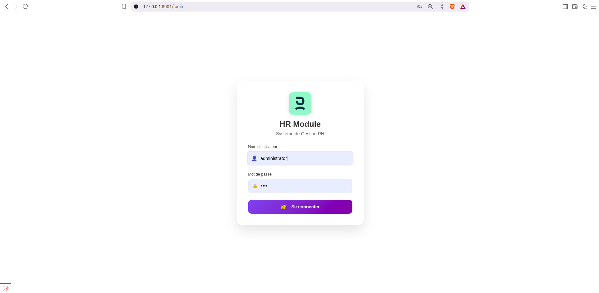
- Connexion sécurisée via compte ERPNext/Frappe
- Interface de login moderne et responsive
- Authentification basée sur l'API ERPNext

### 👥 2. Gestion des Employés
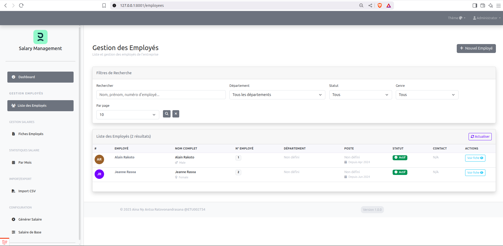
- **Liste des employés** avec système de filtrage avancé par critères multiples
- Recherche dynamique et tri personnalisable
- Synchronisation automatique avec le module RH d'ERPNext

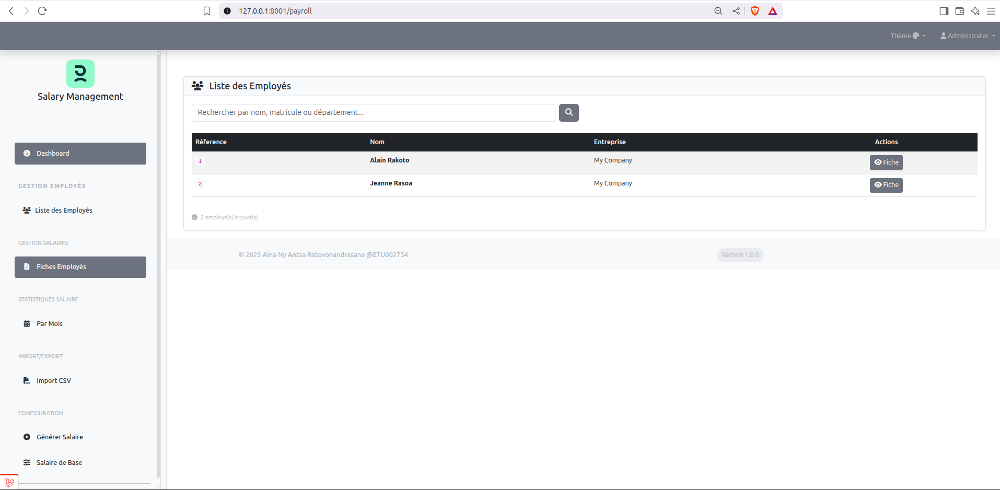 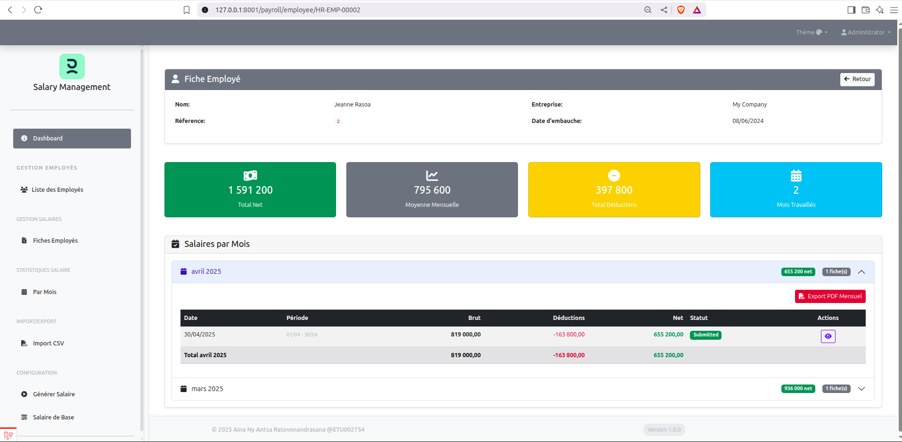
- **Fiche employé détaillée** avec historique complet des salaires mensuels
- Vue d'ensemble des informations personnelles et professionnelles
- Bouton "Voir fiche" pour accès rapide aux détails

### 📊 3. Gestion des Fiches de Paie
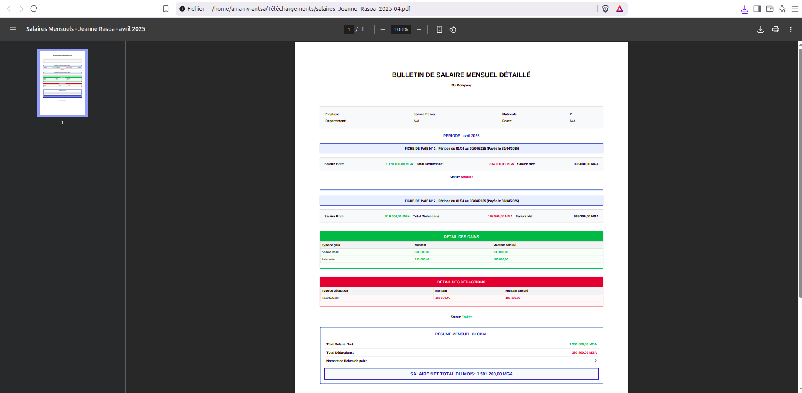
- **Export PDF** des fiches de paie avec mise en forme professionnelle
- Génération automatique des documents officiels
- Template personnalisable selon les besoins légaux

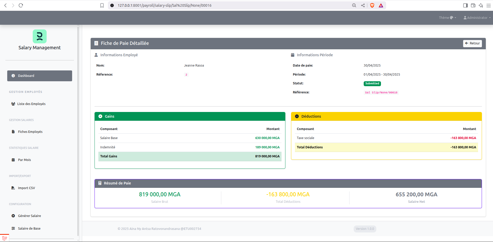
- **Fiche de paie détaillée** avec tous les éléments de calcul
- Décomposition complète : gains, déductions, cotisations
- Calculs automatiques basés sur les structures salariales ERPNext

### 📋 4. Tableau de Bord Salarial
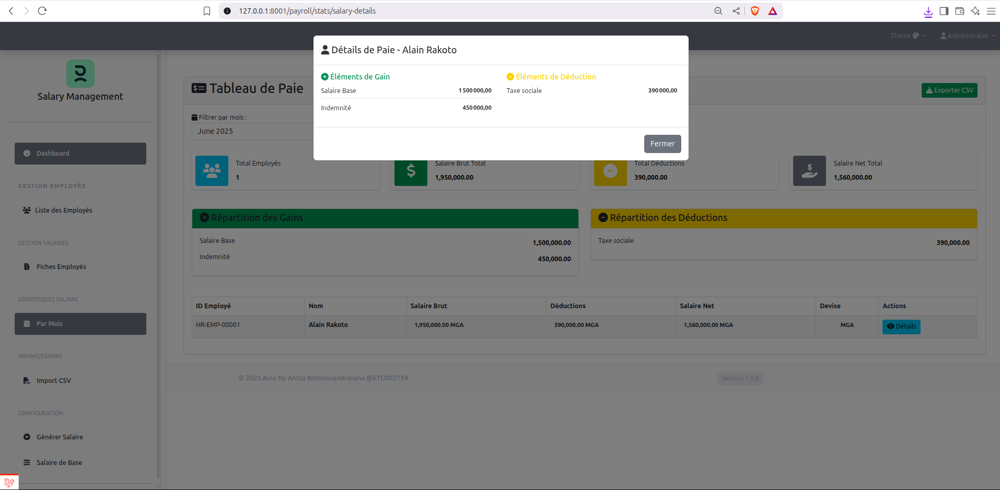
- **Tableau avec filtres par mois** contenant tous les employés
- Affichage des éléments de salaire et totaux automatiques
- Vue consolidée pour la gestion mensuelle

### 📈 5. Analyses et Statistiques
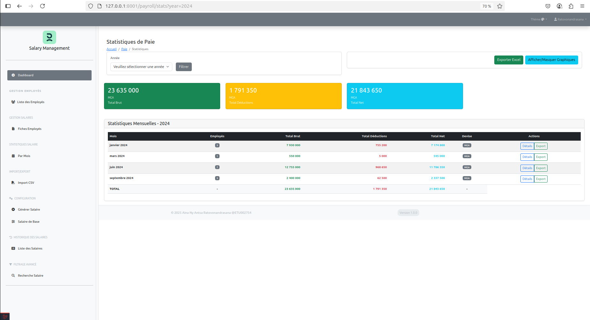
- **Statistiques annuelles** : tableaux par mois avec totaux salariaux détaillés
- Analyse par composant de salaire (base, primes, déductions)
- **Filtrage par année** pour analyses historiques approfondies

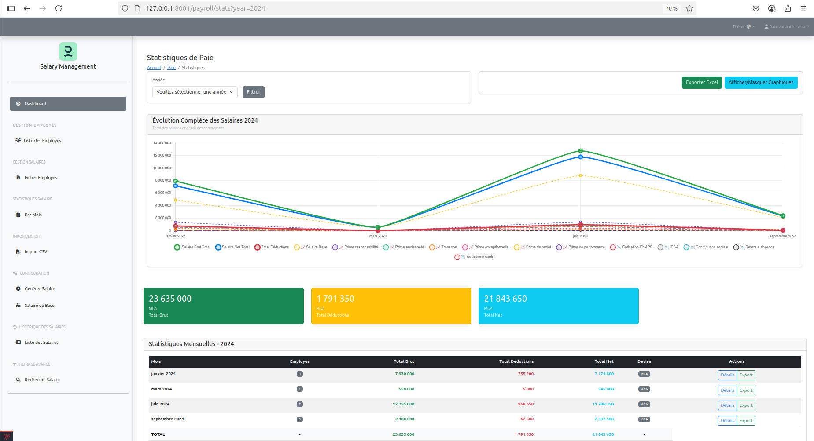
- **Graphiques d'évolution** du total des salaires dans le temps
- Visualisation des différents éléments de salaire
- Tendances et projections salariales

### ⚙️ 6. Configuration et Automatisation
# Configuration et Automatisation

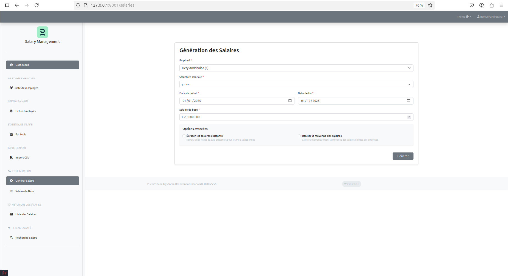 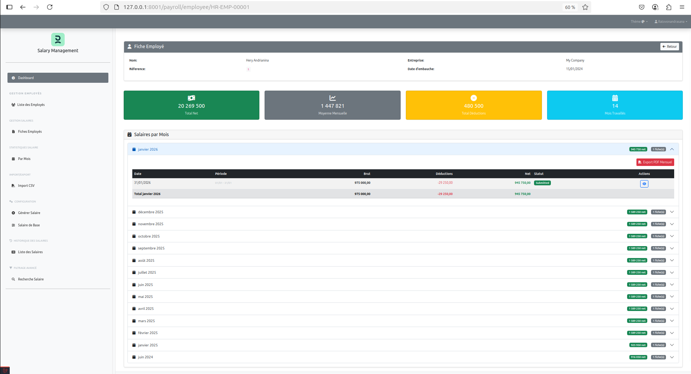

- **Génération automatique** des salaires manquants entre deux dates pour un employé spécifié.
- Formulaire de configuration pour générer les mois manquants avec les options suivantes :
  - **Écrasement des salaires existants** : Lorsque l'option `Écraser les salaires existants` est activée, les `Salary Structure Assignments` et `Salary Slips` existants pour les mois sélectionnés sont annulés (si soumis, `docstatus = 1`) ou supprimés (si brouillon, `docstatus = 0`), puis de nouveaux assignments et slips sont créés avec le salaire de base spécifié ou, si non fourni, le dernier salaire de référence avant la période.
  - **Utilisation de la moyenne des salaires** : Lorsque l'option `Utiliser la moyenne des salaires` est activée, le salaire de base est calculé comme la moyenne des salaires de base des `Salary Structure Assignments` soumis (`docstatus = 1`) pour tous les employés.
  - **Saisie manuelle du salaire de base** : Si un salaire de base est fourni dans le formulaire, il est utilisé pour la génération des salaires. Si aucun salaire de base n'est fourni et l'option de moyenne n'est pas activée, le système utilise le dernier salaire de base soumis avant la période sélectionnée comme référence. Une erreur est retournée si aucun salaire de référence n'est trouvé.
- Exemple : Génération automatique de salaires de 1,500,000 Ar pour les périodes manquantes (par exemple, avril et mai 2025). Si l'option d'écrasement est activée, les salaires existants pour ces mois sont remplacés par 1,500,000 Ar. Si aucun salaire de base n'est fourni, le salaire de mars 2025 (par exemple, 150,000 Ar) est utilisé comme référence pour les deux mois.

###  6. Modification salaire 
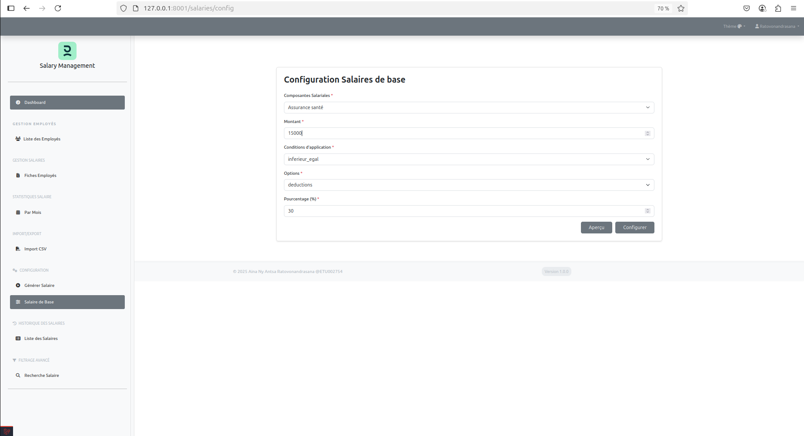
- **Modification du salaire de base** par conditions et règles personnalisées
- Gestion des augmentations et ajustements salariaux
- Interface intuitive pour les modifications en masse

###  7. Historique des salaires avec statistiques
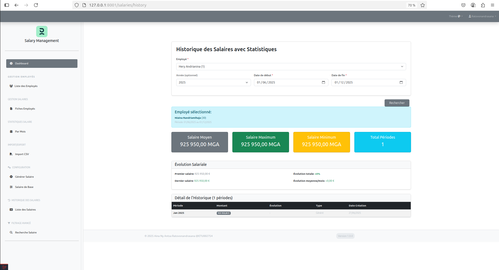
- **Historique des salaires avec statistiques** :
  - Permet de consulter l'historique des salaires d'un employé spécifique sur une période donnée (définie par une date de début et de fin) ou pour une année spécifique.
  - Affiche les détails des `Salary Structure Assignments` et `Salary Slips` pour l'employé, incluant les salaires de base et autres composants salariaux.
  - Calcule des statistiques telles que la moyenne, le minimum, le maximum et l'écart-type des salaires sur la période sélectionnée, offrant une vue d'ensemble des tendances salariales.
  - Interface utilisateur accessible via `salaries.historiques.index`, avec un formulaire pour sélectionner l'employé, la période ou l'année, et afficher les résultats avec des statistiques.
  - Exemple : Consultation de l'historique des salaires pour un employé entre avril et mai 2025, avec une moyenne salariale calculée pour cette période.

###  8. Recherche de salaires par critères
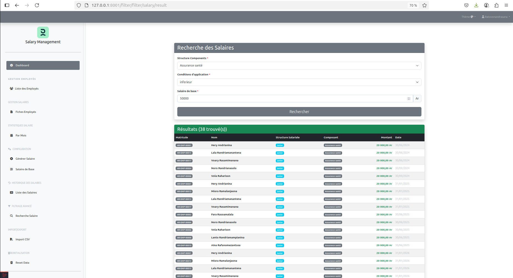
- **Recherche de salaires par critères** :
  - Permet de filtrer les employés selon des critères spécifiques basés sur les composants salariaux, un montant de référence et une condition (inférieur, supérieur, égal, inférieur ou égal, supérieur ou égal).
  - Utilise une interface intuitive (`filter.salary.index`) pour sélectionner un composant salarial (par exemple, salaire de base, prime), un montant et une condition pour identifier les employés correspondants.
  - Affiche les résultats de la recherche, incluant les employés dont les salaires répondent aux critères définis, avec les détails des composants salariaux.
  - Exemple : Recherche des employés ayant un salaire de base supérieur à 1,000,000 Ar, affichant tous les employés correspondants avec leurs détails salariaux.

### 9. Réinitialisation des Données
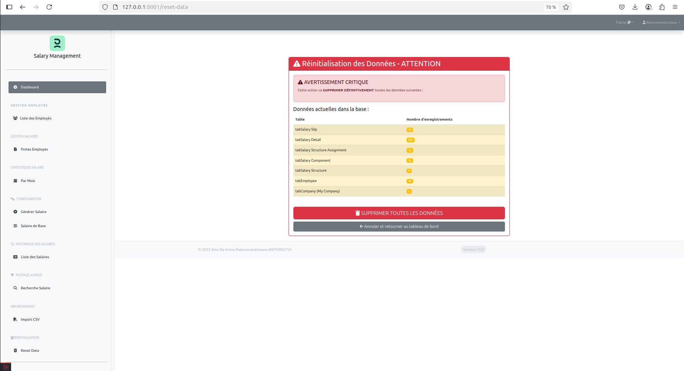

- **Réinitialisation totale ou partielle des données liées aux salaires**.
- Permet à un administrateur de :
  - Vérifier les données existantes à supprimer (employés, fiches de paie, composants, etc.).
  - Supprimer toutes les données après confirmation stricte (`CONFIRMER_SUPPRESSION`).
  - Supprimer uniquement une table spécifique (ex. : `tabEmployee`, `tabSalary Slip`).
  - Utiliser une confirmation en deux étapes avec phrase clé (`SUPPRIMER_TOUTES_LES_DONNEES`) pour éviter les erreurs critiques.
- Toutes les opérations sont traitées via le service `ResetDataService`.
- Interface intuitive pour suivre les étapes de confirmation, affichage des volumes par table, et retour utilisateur clair après action.

### 📥 10. Import de Données CSV
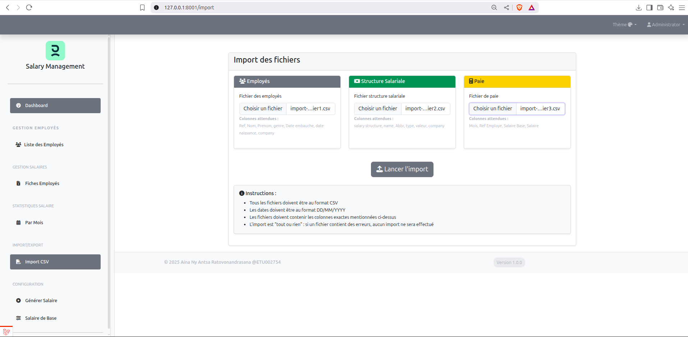
- **Import en masse** via fichiers CSV pour trois types de données
- Validation automatique des données importées
- Interface de mapping des colonnes

## 📋 Formats d'Import CSV

### Employés (`employe.csv`)
```csv
Ref,Nom,Prenom,genre,Date embauche,date naissance,company
1,Rakoto,Alain,Masculin,03/04/2024,01/01/1980,My Company
2,Rasoa,Jeanne,Feminin,08/06/2024,01/01/1990,My Company
```

### Structure Salariale (`StructureSalariale.csv`)
```csv
salary structure,name,Abbr,type,valeur,company
g1,Salaire Base,SB,earning,base,Orinasa SA
g1,Indemnité,IDM,earning,SB * 0.35,Orinasa SA
g1,Taxe spéciale,TSP,deduction,(SB + IDM) * 0.21,Orinasa SA
g1,Impot,IMP,deduction,(SB + IDM - TSP ) * 0.1,Orinasa SA
```

### Paies (`paie.csv`)
```csv
Mois,Ref Employe,Salaire Base,Salaire
01/04/2025,1,1300000,g1
01/04/2025,2,910000,g1
01/03/2025,2,850000,g1
```

## 🛠️ Architecture Technique

### Stack Technologique
- **Framework Backend** : Laravel 10.x
- **Système ERP** : ERPNext/Frappe Framework (Open Source)
- **Module Principal** : Module RH d'ERPNext
- **API Communication** : API REST ERPNext/Frappe
- **Base de données** : MySQL/MariaDB (via ERPNext)
- **Frontend** : Blade Templates + Bootstrap/Tailwind CSS
- **Authentification** : Laravel Sanctum + ERPNext Auth
- **Export PDF** : DomPDF/TCPDF
- **Graphiques** : Chart.js/ApexCharts

### Intégration ERPNext/Frappe
- **Communication API** : Utilisation de l'API REST d'ERPNext
- **Module RH** : Exploitation complète des fonctionnalités RH d'ERPNext
  - Gestion des employés (Employee)
  - Structures salariales (Salary Structure)
  - Fiches de paie (Salary Slip)
  - Composants de salaire (Salary Component)
- **Synchronisation** : Synchronisation bidirectionnelle des données
- **Authentification** : Authentification via les comptes ERPNext

### Fonctionnalités Laravel
- **Artisan Commands** : Commandes personnalisées pour l'import et la synchronisation
- **Jobs/Queues** : Traitement asynchrone des calculs de salaire
- **Middleware** : Authentification et validation des requêtes API
- **Models** : Modèles Eloquent pour la gestion locale des données
- **Services** : Services dédiés pour la communication avec ERPNext

## 📸 Aperçu des Fonctionnalités

L'application propose une interface intuitive avec :
- Dashboard de connexion sécurisé
- Liste des employés avec recherche et filtres
- Fiches employés détaillées
- Génération et export PDF des fiches de paie
- Tableaux de bord avec statistiques complètes
- Graphiques d'évolution temporelle
- Outils de configuration et d'import
- Recherche salaire et suivie avec statistques avec moyennes des salaires et historiques.
- Outils de configuration et d'import

## 🔧 Installation et Configuration

# Guide d'Installation - Salary Management

## 🔧 Prérequis

Avant de commencer l'installation, assurez-vous d'avoir :
- PHP 8.1 ou supérieur
- Composer
- Node.js et npm
- Un serveur web (Apache/Nginx)
- Accès à une instance ERPNext fonctionnelle

## 📋 Étapes d'Installation

### 1. Installation d'ERPNext

Suivez les instructions officielles pour installer ERPNext : [Documentation ERPNext](https://frappeframework.com/docs/user/en/installation). 

**Important :** Assurez-vous que l'environnement ERPNext est correctement configuré avant de procéder aux étapes suivantes.

### 2. Installation du module HRMS

Installez le module HR (HRMS) requis pour la gestion des salaires :

```bash
bench get-app hrms
ls sites/
bench --site erpnext.localhost install-app hrms
```

**Note :** La commande `ls sites/` permet de vérifier le nom du site ERPNext (par exemple, `erpnext.localhost`). Remplacez `erpnext.localhost` par le nom de votre site.

### 3. Configuration ERPNext

#### 3.1 Activer l'API REST
- Aller dans ERPNext > Paramètres > Paramètres système
- Activer "Allow REST API"

#### 3.2 Créer les API Keys
- Générer des clés API pour l'authentification
- Configurer les permissions pour le module RH

#### 3.3 Vérifier les modules RH requis
Assurez-vous que les modules suivants sont disponibles :
- Employee (Employé)
- Salary Structure (Structure Salariale)
- Salary Component (Composant de Salaire)
- Salary Slip (Fiche de Paie)
- Employment Type (Type d'Emploi)
- Department (Département)

### 4. Installation du projet Salary Management

#### 4.1 Cloner le repository
```bash
git clone https://github.com/antsamadagascar/salary_management.git
cd salary_management
```

#### 4.2 Installer les dépendances
```bash
# Dépendances PHP
composer install

# Dépendances JavaScript
npm install
npm run build
```

#### 4.3 Configuration Laravel
```bash
# Copier le fichier de configuration
cp .env.example .env

# Générer la clé d'application
php artisan key:generate
```

#### 4.4 Configuration des variables d'environnement
Modifier le fichier `.env` avec vos paramètres ERPNext :

```env
APP_KEY=votre_api_key_generate_laravel
ERP_API_KEY=votre_api_key
ERP_API_SECRET=votre_api_secret
ERP_API_URL=https://votre-erpnext.com
```

### 5. Lancement de l'application

```bash
php artisan serve
```

### 6. Accès à l'application

Ouvrir [http://127.0.0.1:8000/](http://127.0.0.1:8000/) dans votre navigateur et se connecter avec les identifiants ERPNext.

## 🚀 Démarrage Rapide

Pour une installation rapide (si ERPNext est déjà configuré) :

```bash
# 1. Cloner et installer
git clone https://github.com/antsamadagascar/salary_management.git
cd salary_management
composer install
npm install && npm run build

# 2. Configurer
cp .env.example .env
php artisan key:generate

# 3. Modifier .env avec vos paramètres ERPNext

# 4. Lancer
php artisan serve
```

## ⚠️ Notes importantes

- Vérifiez que votre instance ERPNext est accessible avant de configurer l'application
- Les clés API doivent avoir les permissions appropriées pour accéder aux modules RH
- Le port par défaut est 8000, mais vous pouvez le modifier si nécessaire
- Assurez-vous que tous les modules HRMS requis sont installés et configurés dans ERPNext

## Importer les données

Importer les données via les fichiers CSV d'exemple(data/data-test/data-true).


## 📊 Avantages de l'Architecture

### Avantages Laravel
- **Framework mature** et bien documenté
- **Système de routing** élégant et puissant
- **ORM Eloquent** pour la gestion des données
- **Artisan CLI** pour l'automatisation des tâches
- **Système de cache** intégré pour les performances
- **Validation** robuste des données
- **Sécurité** native (CSRF, XSS, SQL Injection)

### Avantages ERPNext/Frappe
- **Solution open source** complète et gratuite
- **Module RH complet** avec toutes les fonctionnalités nécessaires
- **API REST native** pour l'intégration
- **Gestion des permissions** granulaire
- **Workflows personnalisables** pour les processus RH
- **Rapports intégrés** et tableaux de bord
- **Multi-entreprises** et multi-devises

### Bénéfices de l'Intégration
- **Interface moderne** Laravel avec puissance ERPNext
- **Données centralisées** dans ERPNext
- **Flexibilité d'interface** avec Laravel
- **Évolutivité** grâce à l'architecture modulaire
- **Maintenance simplifiée** avec deux systèmes spécialisés
- **Performance optimisée** avec cache Laravel

## 🏗️ Structure du Projet

```
salary_management/
├── app/
│   ├── Http/
│   │   ├── Controllers/
│   │   │   ├──AuthController.php
│   │   │   ├──ConfigurationSalaryController.php
│   │   │   ├──EmployeeController.php
│   │   │   ├──EmployeePayrollController.php
│   │   │   ├──FilterSalaryController.php
│   │   │   ├──GenerateSalaryController.php
│   │   │   ├──HistoryController.php
│   │   │   ├──ImportController.php
│   │   │   ├──PayrollStatsController.php
│   │   │   ├──ResetDataController.php
│   │   │   └──SalaryDetailsController.php
│
│   ├── Services/
│   │   ├── api/
│   │   │   └── ErpApiService.php
│   │   ├── config/
│   │   │   └── SalaryConfigService.php
│   │   ├── employee/
│   │   │   └── EmployeeService.php
|   |   ├── filter/
│   │   │   └── FilterService.php
│   │   ├── export/
│   │   │   └── ExportService.php
│   │   ├── generate/
│   │   │   └── SalaryService.php
|   |   ├── history/
│   │   │   └── HistorySalaryService.php
│   │   ├── import/
│   │   │   ├── EmployeeServiceImport.php
│   │   │   ├── FiscalYearManagerService.php
│   │   │   ├── PayrollServiceImport.php
│   │   │   └── SalaryStructureServiceImport.php
│   │   ├── Payroll/
│   │   │   ├── PayrollDataService.php
│   │   │   ├── PayrollEmployeeService.php
│   │   │   └── PayrollStatsService.php
│   │   ├── resetData/
│   │   │   ├── ResetDataService.php
│   |   |
│   ├── Models/
│   │   └── User.php
│
├── resources/
│   ├── views/
│   │   ├── auth/
│   │   ├── employees/
│   │   ├── filter/
│   │   ├── configuration/
│   │   ├── import/
│   │   ├── payroll/
│   │   ├── layouts/
│   │   ├── reset-data/
│   │   ├── salaries/
│   │   └── dashboard/


**Développé avec Laravel 🔥 et ERPNext 🚀 pour une gestion moderne et efficace des salaires** 💪

## 📞 Support

Pour toute question ou problème :
- 📧 Email : antsamadagascar@gmail.com
