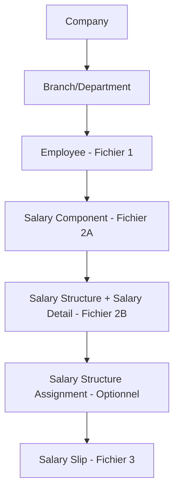

# 📋 Frappe ERPNext HR - Guide Complet

## 🚀 INSTALLATION MODULE HR

```bash
# 1. Télécharger le module HRMS
bench get-app https://github.com/frappe/hrms

# 2. Installer sur le site
bench --site erpnext.localhost install-app hrms

# 3. Migrer la base de données
bench --site erpnext.localhost migrate

# 4. Redémarrer
bench stop
bench start
```

## 🔗 API ENDPOINTS

**Base URL:** `http://erpnext.localhost:8000/`

### Endpoints Disponibles
| DocType | Endpoint | Méthode |
|---------|----------|---------|
| Branch | `/api/resource/Branch` | GET, POST |
| Company | `/api/resource/Company` | GET, POST |
| Department | `/api/resource/Department` | GET, POST |
| Employee | `/api/resource/Employee` | GET, POST |
| Holiday List | `/api/resource/Holiday List` | GET, POST |
| Salary Component | `/api/resource/Salary Component` | GET, POST |
| Salary Structure | `/api/resource/Salary Structure` | GET, POST |
| Salary Structure Assignment | `/api/resource/Salary Structure Assignment` | GET, POST |
| Salary Slip | `/api/resource/Salary Slip` | GET, POST |

### Exemples d'utilisation
```bash
# Lister toutes les branches
curl -X GET "http://erpnext.localhost:8000/api/resource/Branch"

# Créer un employé
curl -X POST "http://erpnext.localhost:8000/api/resource/Employee" \
  -H "Content-Type: application/json" \
  -d '{"first_name": "Jean", "last_name": "Dupont"}'
```

## 🗄️ STRUCTURE DES DOCTYPES

### Doctypes Principaux

#### 🏢 Company
```sql
SELECT * FROM `tabCompany`;
```
**Champs:** `name`, `company_name`, `default_currency`, `country`

#### 🌿 Branch
```sql
SELECT * FROM `tabBranch`;
```
**Champs:** `name`, `branch`

#### 🏛️ Department
```sql
SELECT name, department_name FROM `tabDepartment`;
```
**Champs:** `name`, `department_name`

#### 👤 Employee
```sql
SELECT last_name, first_name, gender, date_of_birth, salutation, 
       date_of_joining, status, branch, department, employee_number, 
       ctc, salary_currency, salary_mode 
FROM `tabEmployee`;
```

#### 🏖️ Holiday List
```sql
SELECT * FROM `tabHoliday List`;
```

#### 💰 Salary Structure
```sql
SELECT * FROM `tabSalary Structure`;
```

#### 🧮 Salary Component
```sql
SELECT * FROM `tabSalary Component`;
```

#### 📋 Salary Structure Assignment
```sql
SELECT * FROM `tabSalary Structure Assignment`;
```

#### 📊 Salary Detail
```sql
SELECT * FROM `tabSalary Detail`;
```

#### 💸 Salary Slip
```sql
SELECT * FROM `tabSalary Slip`;
```

## 🔄 WORKFLOW D'IMPORT



### Ordre d'Exécution Obligatoire

1. **Company** - Configuration de base
2. **Branch/Department** - Organisation (optionnel)
3. **Employee** - Import du fichier 1 (employés)
4. **Salary Component** - Import du fichier 2A (composants salariaux)
5. **Salary Structure + Salary Detail** - Import du fichier 2B (structures)
6. **Salary Structure Assignment** - Attribution (optionnel mais recommandé)
7. **Salary Slip** - Import du fichier 3 (bulletins de paie)

## 📁 FICHIERS CSV À TRAITER

### Fichier 1: `employees.csv`
- Employés de base
- **Cible:** DocType `Employee`

### Fichier 2A: `salary_components.csv`
- Composants salariaux (Salaire Base, Indemnités, Déductions)
- **Cible:** DocType `Salary Component`

### Fichier 2B: `salary_structure.csv`
- Structures salariales avec détails
- **Cible:** DocType `Salary Structure` + `Salary Detail`

### Fichier 3: `salary_slips.csv`
- Bulletins de paie mensuels
- **Cible:** DocType `Salary Slip`

## ⚠️ POINTS IMPORTANTS

- **Dépendances:** Respecter l'ordre du workflow
- **Relations:** Vérifier les liens entre doctypes
- **API Authentication:** Configurer les tokens d'accès
- **Validation:** Tester chaque étape avant de passer à la suivante

## 🔧 DÉPANNAGE

```bash
# Vérifier le statut des services
bench status

# Logs en temps réel
bench watch

# Redémarrer en cas de problème
bench restart
```